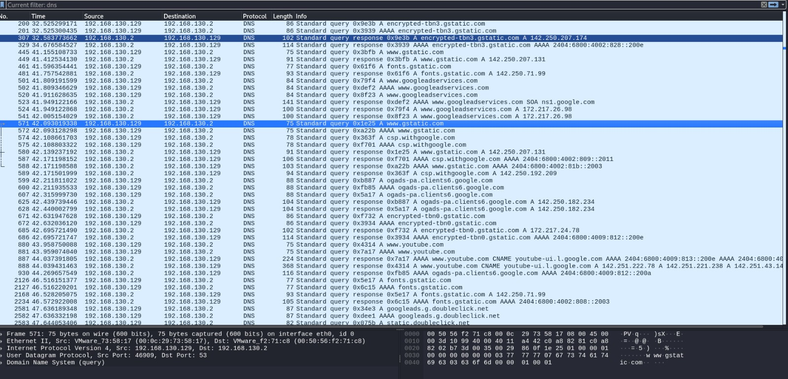
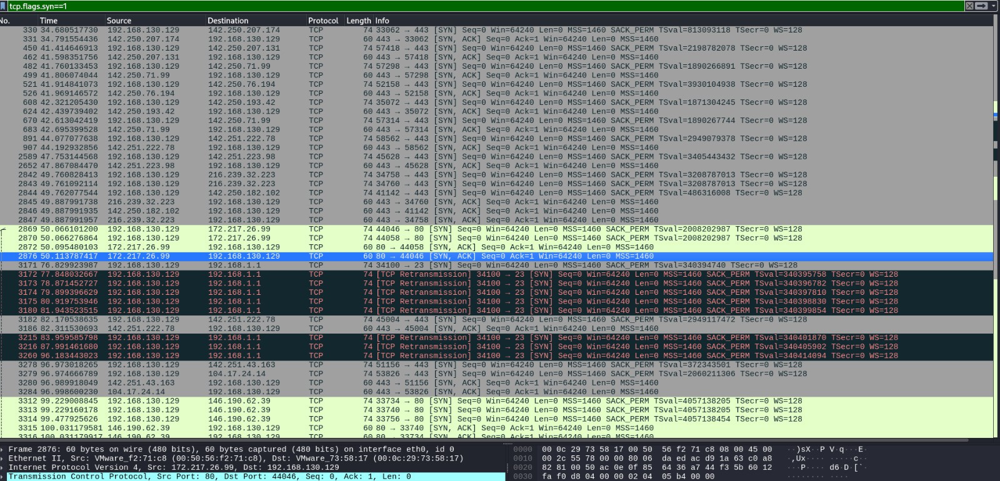
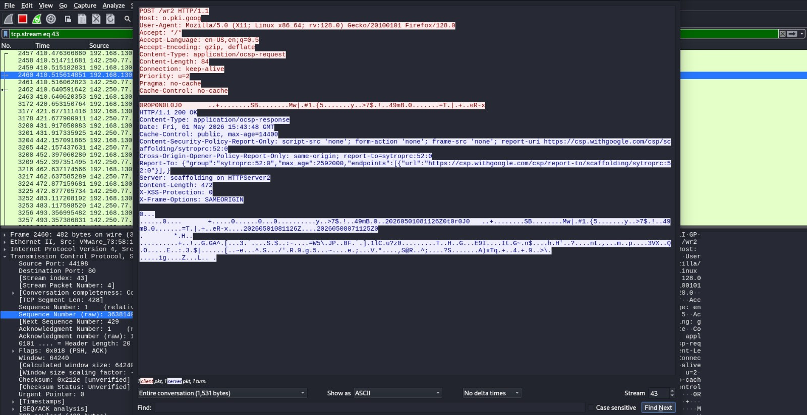
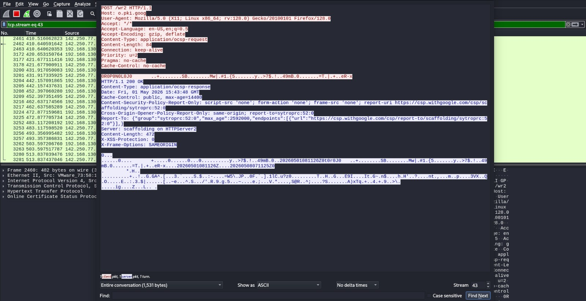
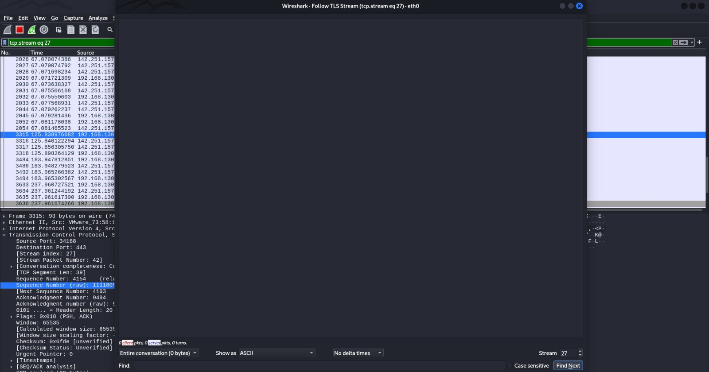
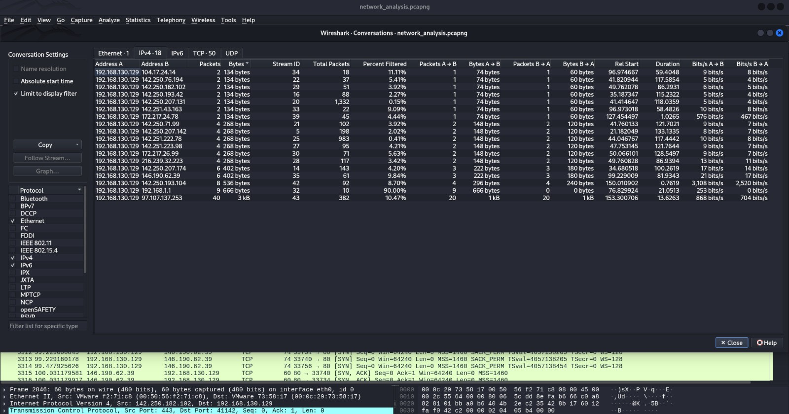
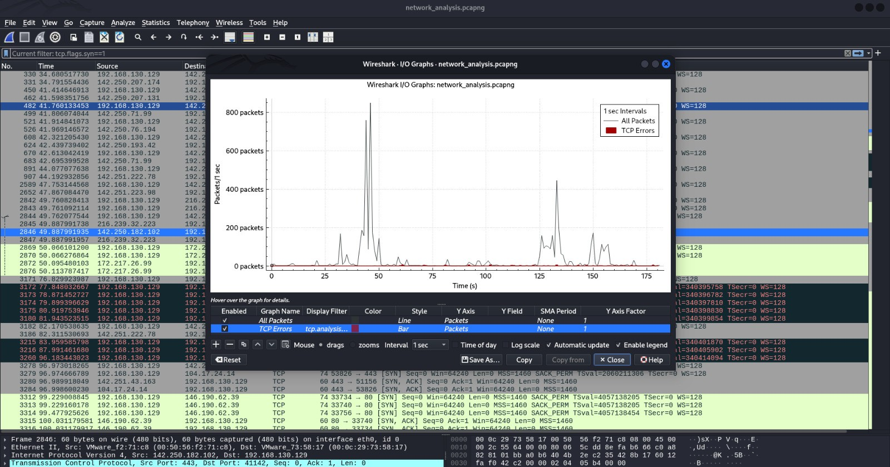

# Network Traffic Analysis & Security Monitoring with Wireshark

## Project Overview
This project focuses on **Deep Packet Inspection (DPI)** and network security monitoring. Using Wireshark, I captured and analyzed real-time traffic to understand protocol behaviors, troubleshoot connectivity issues, and demonstrate the security gap between encrypted and unencrypted communications.

##  Environment & Tools
* **Analyzer:** Wireshark
* **Operating System:** Debian 10 (Virtual Machine)
* **Hypervisor:** VMware Workstation
* **Protocols:** TCP, UDP, DNS, HTTP, TLS, QUIC

##  Phase 1: Protocol Inspection (DNS & TCP)
The foundation of network communication relies on DNS resolution and reliable transport.

### **1. DNS Query Analysis**
I monitored how the system resolves domain names into IP addresses.
* **Findings:** Captured A (IPv4) and AAAA (IPv6) records for Google-related services.
* **Security Insight:** DNS traffic is unencrypted, meaning an attacker could intercept these queries to perform reconnaissance.
> **Visual Reference:** 

### **2. TCP Three-Way Handshake & Retransmissions**
I analyzed the connection establishment phase (`SYN` -> `SYN-ACK` -> `ACK`).
* **Observation:** Identified several **[TCP Retransmissions]** targeting Port 23 (Telnet). This confirms a failed connection attempt to an insecure legacy protocol.
> **Visual Reference:** 

##  Phase 2: Clear-Text vs. Encrypted Traffic
This phase demonstrates why modern web security relies on encryption to prevent data sniffing.

### **1. HTTP (Insecure Communication)**
By following the HTTP stream, I was able to extract plain-text metadata directly from the packets.
* **Exposed Data:** User-Agent strings, Host details, and OCSP requests were fully visible.
> **Visual Reference:** 

### **2. TLS/QUIC (Secure Communication)**
In contrast, analyzing TLS and QUIC traffic showed that the payload is fully protected.
* **Observation:** The stream content appeared as unreadable ciphertext, preventing Man-in-the-Middle (MITM) attacks.
> **Visual Reference:** 

##  Phase 3: Traffic Statistics & Visualization
Using Wireshark’s analytical engine, I visualized the network load and identified "top talkers."

### **1. Network Conversations**
I mapped traffic between my host (`192.168.130.129`) and various external endpoints to understand bandwidth distribution.
> **Visual Reference:** 

### **2. I/O Graphs**
The I/O Graph highlights real-time traffic density. I observed significant spikes reaching **800 packets/second**, which is a critical metric for detecting potential DoS (Denial of Service) patterns.
> **Visual Reference:** 

##  Security Findings & Recommendations
1. **Protocol Hardening:** Connection attempts to **Telnet (Port 23)** were detected. All remote management should be transitioned to **SSH (Port 22)**.
2. **Mandatory Encryption:** Plain-text metadata was captured over HTTP. Recommendation: Enforce **HSTS** (HTTP Strict Transport Security).
3. **Anomaly Detection:** Use I/O Graphs to establish a network baseline and set alerts for unusual traffic bursts.

**Author:** Sameer Singh
*B.Tech Computer Science & Engineering Student*